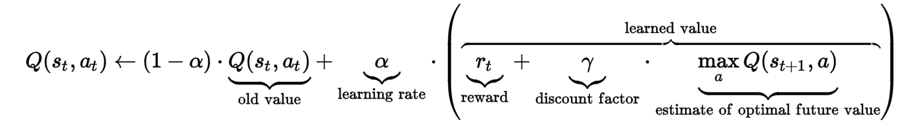

# Q Learning with OpenAI gym 

https://github.com/ElliotVilhelm/

### OpenAI Gym
OpenAI is a non-profit AI research company. OpenAI's Python module "gym" provides us with many environments with which we can experiment and solve. 

### CartPole 
- A pole is attached by an un-actuated joint to a cart, which moves along a frictionless track. 

- The system is controlled by applying a force of +1 or -1 to the cart. 

- The pendulum starts upright, and the goal is to prevent it from falling over. 

- A reward of +1 is provided for every timestep that the pole remains upright. 

- The episode ends when the pole is more than 15 degrees from vertical, or the cart moves more than 2.4 units from the center.


### An Example
- In the cell below the environment is run for 1000 steps, at each step a random decision is made, move left or move right

- The env.step() method takes an action as an input and outputs four variables, observation, reward, done, info.
- Observation will describe our environment, the reward will represent the reward earned at the time step, done will decribes if the trial is over, meaning we have won or lost, and info will be ntohing in this environment.

```python
import gym
env = gym.make('CartPole-v0')
env.reset()

for ep in range(10):
    env.reset()
    for _ in range(150):
        env.render()
        obv, reward, done, info = env.step(env.action_space.sample()) # take a random action
```

# Action Space & Observation Space

One of the great things about OpenAI gym is that the environments are set up with a given action_space and observation_space. Here they are defined as follows.

### Action Space 
- Left given as -1    (move left in x direction)
- Right given as +1   (move right in y direction)
* Our Action space is "discrete"


### Observation Space
#### ( X, X', θ, θ')
- X = X postion of cart
- X' = X speed of cart
- θ = angle of pole with cart
- θ' = angular veloctiy of pole with cart
* Our Observation space is continuous. 


```{.python .input}
import gym
env = gym.make('CartPole-v0')
print ("Action Space: ", env.action_space)
print("Observation Space: ", env.observation_space)
```

# Reinforcement Learning Loop


**The environment is described by our observation space. Our agent will be given a state which will be composed of the observation space and the reward.**

1. **The agent will make a decision of which action to take at the given state and reward**
2. **The action will be applied to the environment changing the state of the environment**
3. **The new state and reward will be provided to the agent from which it will "learn"**
4. **Repeat!**


## Q Learning 
The Agent given a state must have a policy to decide on which action to take. The policy we will use is Q learning.

### The Bellman Equation
the expected long-term reward for a given action is equal to the immediate reward from the current action combined with the expected reward from the best future action taken at the following state.




- The discount factor "γ" will determine how much future rewards are worth
- The learning rate "α" represents how much new information will overite old information, range [0,1]. 

We are using Q learning to find the best action-selection policy. We will learn an action-value function which will represets the value of an action at a state. 

In this demo we will implement a lookup-table version of the algorithm. Initially our agent will make random decisions and gradually shift to makign its decisions off the Q table. The probability of making a random decision will be represented by the "Exploration Rate" which will decrease over time

The lookup table, Q table, will be a matrix "state x action" matrix, We will have 162 states after we discretize the observation space below. We will have two actions at any given state thus out matrix will be 162 x 2. 

| Q Table   | Action 1: Left | Action 2: Right |
|-----------|----------------|-----------------|
| State 1   | 0.1            | 0.3             |
| State 2   | -.4            | .7              |
| State 3   | 1.3            | .3              |
| ..        |                |                 |
| ..        |                |                 |
| State 161 | 2.2            | .9              |
| State 162 | 1.2            | 1.4             |


## Creating a discrete observation space
#### ( X, X', θ, θ') ⊆ ℝ 
The set of all real numbers is an uncountably infinite set. Between 0 and 1 there are infinetly many numbers, ie: .1, .2, .3 .312342342 ....

There are infitely many states and we cannot generate an infinetly large table, thus to apply this method we must generate a discrete number of states  from our infinetly many observations

We will divide each variables range into a fintie number of spaces. 

For example, take the range **[0,1]**, although there are infitely many numbers between 0,1 we can split the range into any number of chunks.

**Such as { [0, 0.25], [0.25, 0.5], [0.5, 0.75], [0.75, 1]**

Now there are only four states between 0 and 1.
We will perform a similar operation on our sample space in Python below

Lets call out staes "boxes", 
#### Splits = (3,3,6,3)
Our X will be split into 3 boxes, X' into 3 boxes, θ into 6 boxes, θ' into 3 boxes
#### This yeilds 162 boxes = 3*3*6*3


```python
# Input a cartPole observation state
# A box number ranging from 0-162
def get_Box(obv):
	x, x_dot, theta, theta_dot = obv
    
	if x < -.8:
		box_number = 0
	elif x < .8:
		box_number = 1
	else:
		box_number = 2

	if x_dot < -.5:
		pass
	elif x_dot < .5:
		box_number += 3
	else:
		box_number += 6

	if theta < np.radians(-12):
		pass
	elif theta < np.radians(-1.5):
		box_number += 9
	elif theta < np.radians(0):
		box_number += 18
	elif theta < np.radians(1.5):
		box_number += 27
	elif theta < np.radians(12):
		box_number += 36
	else:
		box_number += 45

	if theta_dot < np.radians(-50):
		pass
	elif theta_dot < np.radians(50):
		box_number += 54
	else:
		box_number += 108

	return box_number


```

### Helper functions


##### Explore Rate
We will need a few functions to modify the learning rate and the exploration rate. The exploration rate decides wether we make a random move or we choose based off of the Q table. The value will start high and grow smaller over time as our Q table begins to more accurately reflect the action-value.

```python
# Explore Rate Decay Function, Converges to MIN_EXPLORE_RATE
def update_explore_rate(episode):
	return max(MIN_EXPLORE_RATE, min(1, 1.0 - np.log10((episode + 1) / 25)))
```

##### Learning Rate
As we learn the right Q values to solve the environment we want to reduce the rate at which we over write them. 

```python
# Explore Rate Decay Function, Converges to MIN_LEARNING_RATE
def update_learning_rate(episode):
	return max(MIN_LEARNING_RATE, (min(0.5, 1.0 - np.log10((episode + 1) / 50))))
```

##### Update Action
This function will take the state and exploration rate as an input. It will decide with a probability dependent on the exploration rate wether to take a random action or to take the action with the maximum value on the Q table

```python
def update_action(state, explore_rate):
	if random.random() < explore_rate:
		return env.action_space.sample()
	else:
		return np.argmax(Q[state])
```

# Q Learn
We are now ready to define the algorithm

```python
def q_learn():
	total_reward = 0
	total_completions = 0
	explore_rate = update_explore_rate(0)
	learning_rate = update_learning_rate(0)

	for i in range(NUM_EPISODES):
		observation = env.reset()
		state_0 = get_Box(observation)
		for _ in range(250):
			env.render()
			action = update_action(state_0, explore_rate)
			obv, reward, done, info = env.step(action)
			state_1 = get_Box(obv)

			q_max = np.max(Q[state_0])
			Q[state_0, action] += learning_rate*(reward + GAMMA*np.amax(Q[state_1])- Q[state_0, action])
			state_0 = state_1

			total_reward += reward

			if done:
				if _ > 192:
					total_completions += 1
				break

		learning_rate = update_learning_rate(i)
		explore_rate = update_explore_rate(i)
		print("Completions : ", total_completions)
		print("REWARD/TIME: ", total_reward/(i+1))
		print("Trial: ", i)
		#print("Final Q values: ", Q)
```

```python
import numpy as np
import random
import gym

"""
lets define some constants first
"""

GAMMA = 0.99
NUM_EPISODES = 2000
MIN_EXPLORE_RATE = 0.01
MIN_LEARNING_RATE = 0.05
Q = np.random.rand(162, env.action_space.n)  # 162 x 2 noisey matrix


q_learn()

# note "esc r y"  to clear output
```

```python
print("is my kernel dead")
```
